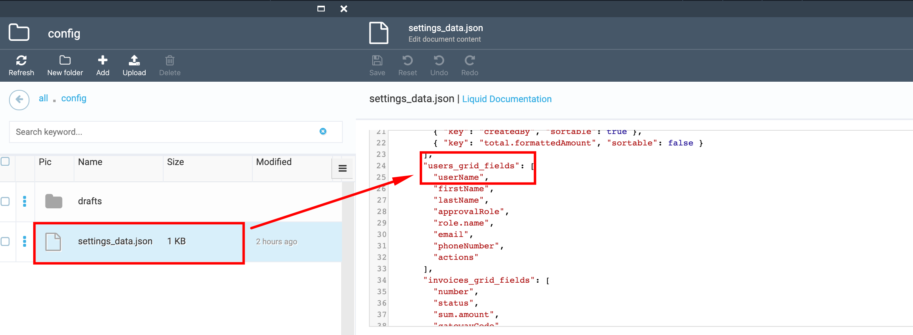

# Add a Column to a Table Layout (if data exists in DB)

1. Go to Content module->select the ODT Store->Themes widget->select the 'current' theme;

1. Select the config folder and then the 'settings_data.json' file

1. In the opened file make the corresponding changes - add a new column, ex. "userName";

1. Save the changes;

1. View the results on the Storefront.
