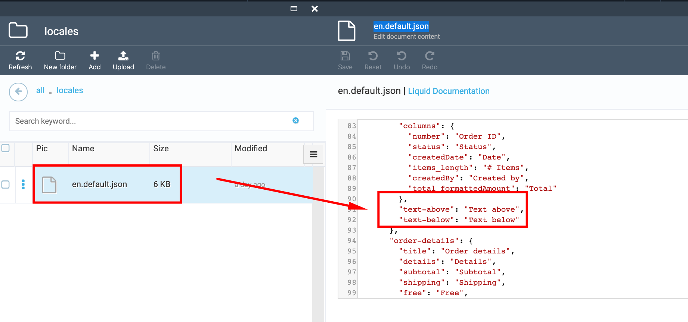

# Add/delete/modify text block 

1. Go to Content module->select ODT Store->Themes widget ->select the 'current' theme;

1. In the opened 'Manage theme assets' blade select the 'Locales' folder;

1. Select the 'en.default.json' file in the opened folder;

1. Find the grid localization terms;

1. Modify the text below or above the term;

1. To delete the text block, set it as an empty string ("");

1. Save the changes;

1. Go to Storefront and view the result.