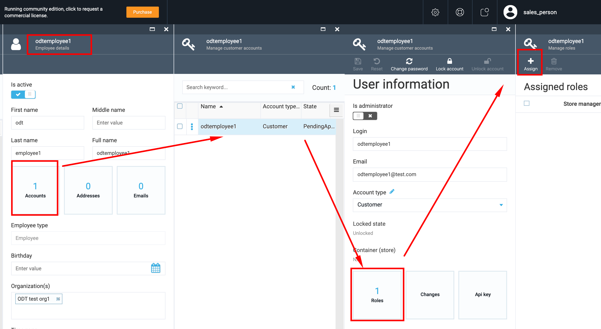
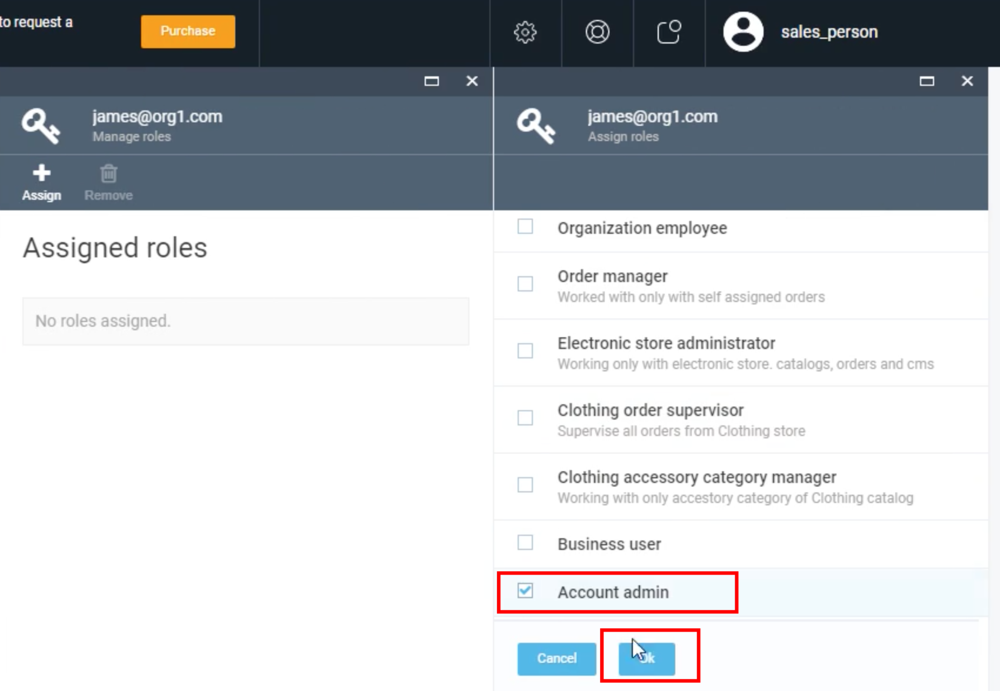

# Assign Admin Role to a Contact

The Sales person on Seller side can select an Organization assigned to him and assign an admin role to a contact within this Organization

1. Sign in as a Sales to VC Platform
1. Go to More->Contacts;
1. Select the Organization and then select a contact person;
1. Click on the 'Accounts' widget;
1. Open the security Account of the contact person;
1. Click the 'Assign' button;
1. Select 'Account admin';
1. Clicks 'Save';
1. The Account admin role will be assigned to the contact.

