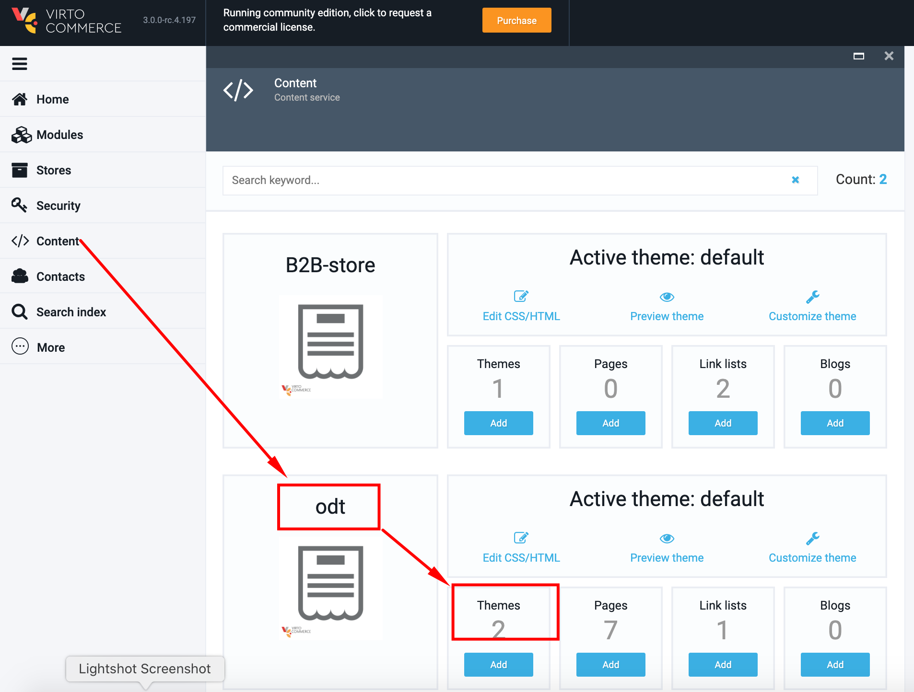
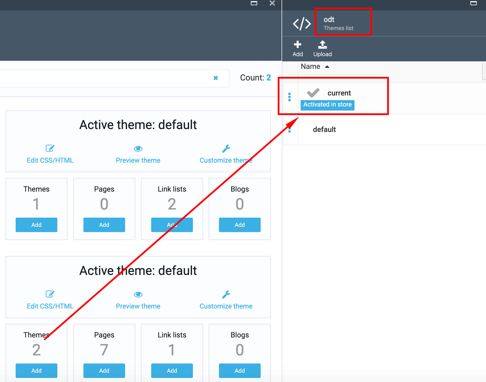
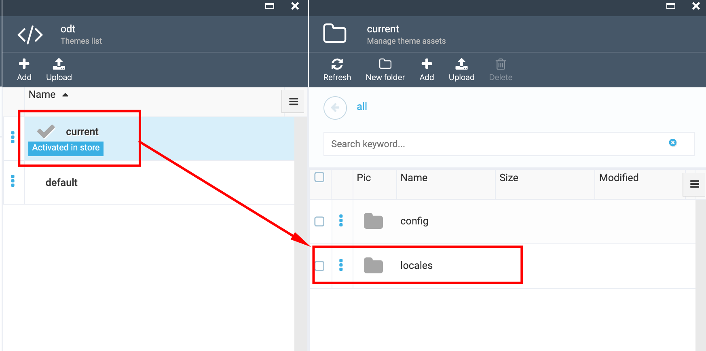
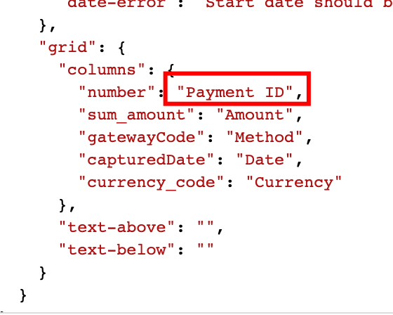
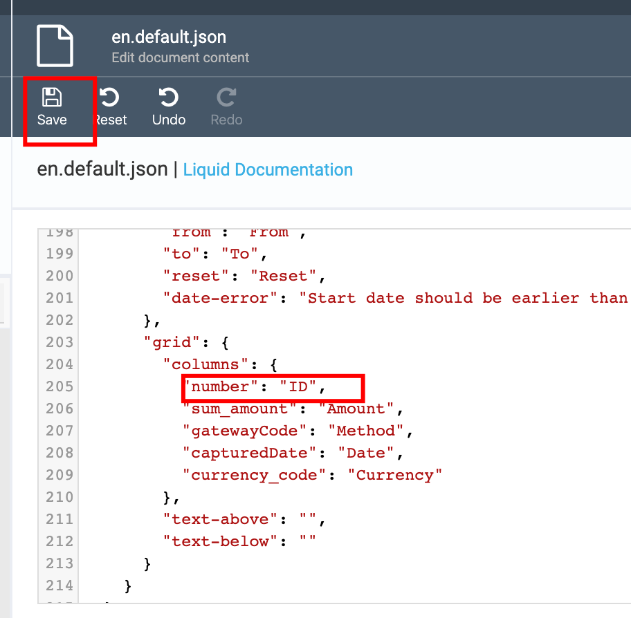
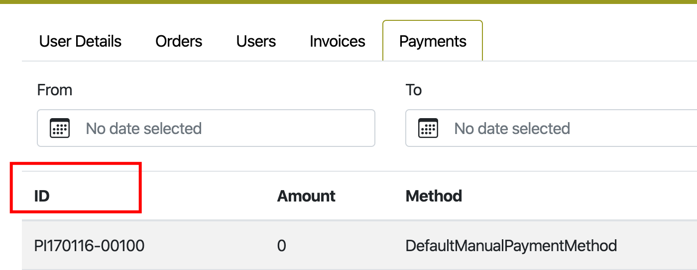

# How to change the column name

To change the name of the column, you should change the corresponding term in the localization file. In order to do that, simply go through the following steps:

1. Go to Content module->select ODT store->select 'Themes' widget;

1. In the opened blade (Themes list) select the 'current' theme (Activated in store);

1. Select the 'Locales' folder and then select the localization file (en.default.json), where you should to make the changes;

1. In the json file find the tab name (ex, Payments), then find the 'columns' term;

1. Select the column, ex. Payment ID;

1. Change the column name, ex. delete 'Payment' and keep only the ID;

1. Save the changes by clicking the 'Save' button;

1. Open the Storefront;

1. The column name will be changed.

