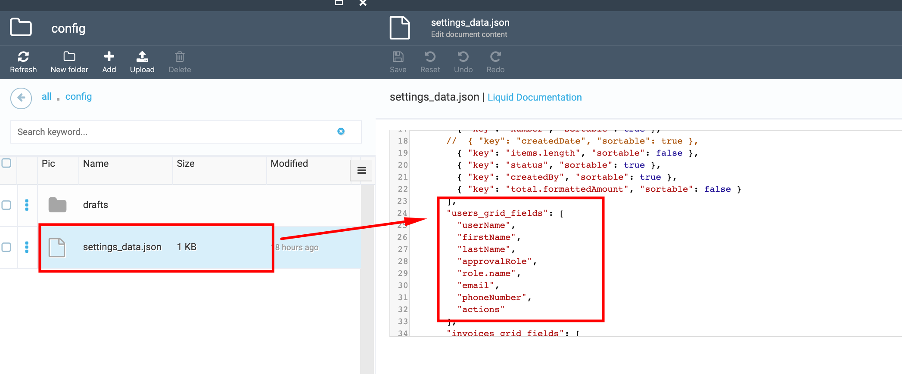

# Change columns order

1. Go to Content module-> ODT Store-> 'Themes' widget;

1. In the opened 'Themes list' blade select the 'Current' theme (Activated in store);

1. In the 'Manage theme assets' blade  select the 'config' folder;

1. Select the "settings_data.json" file;

1. In the opened json file find the grid columns settings;

1. Reorder the lines in file according to column settings;

1. Save the changes;

1. Open the Storefront;

1. The columns order will be changed.