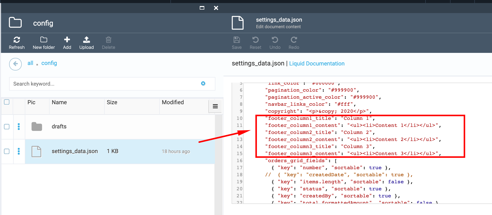

# How to Change footer

1. Go to Content module-> ODT Store->Themes widget-> select the 'Current' theme;

1. In the 'Manage theme assets' select the 'config' folder ->then select the "settings_data.json" file;

1. In the opened json file find the footer settings;

1. Make the changes you need (text, color, etc.);

1. Save the changes;

1. Open the Storefront;

1. View the changes made to the footer.