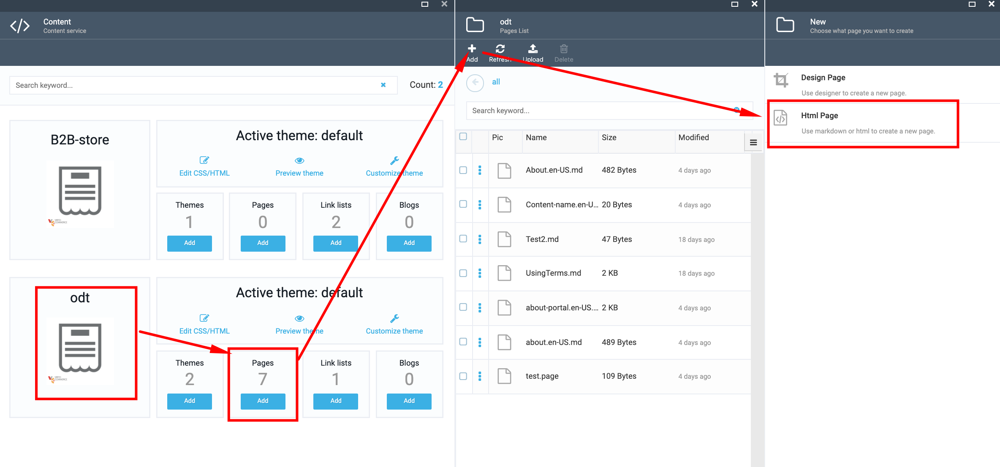
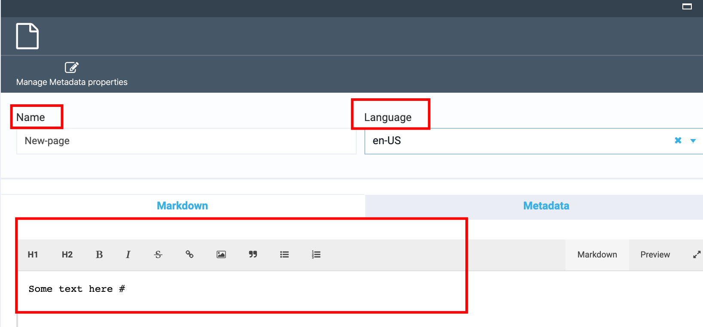
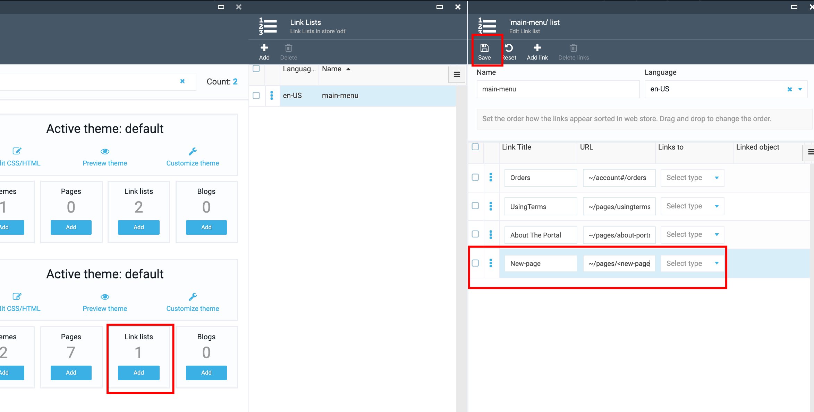

# How to create a new landing/static page

1. Go to Content module->select the ODT store->select the 'Pages' widget of this store

1. In the opened blade (Pages list) click the 'Add' button;

1. Select 'Html Page';

1. Enter the  'Page name' (ex., New) into the field;

1. Enter the  page content (the content you want to see on the page on Storefront);

1. Click the 'Create' button;

1. The new page will be created;

## How to publish the new page

1. Go to Content module-> select the ODT-> select the 'Links' widget;

1. In the opened blade (Links list) click 'Add' to add a new link;

1. Enter the  link title and the pageURL ~/pages/<page_name>" into the corresponding fields;

1. Click the 'Save' button;

1. The new link will be created;

1. Open the Storefront;

1. The new page will be displayed on the Store

