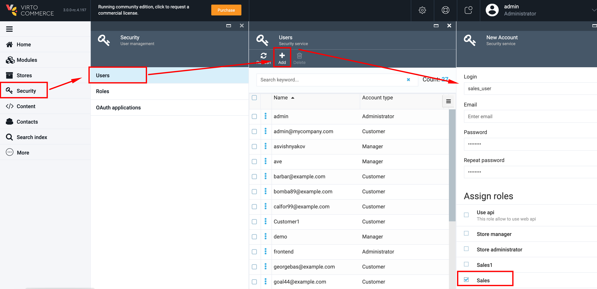
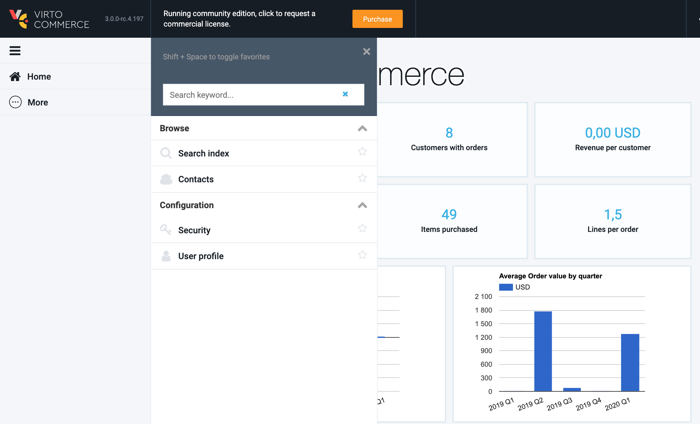

# Create a Sales Account

1. Go to More->Security->Users;
1. In the opened 'Users' blade click the 'Add' button;
1. In the opened 'New Account' blade enter the Login, Password into the corresponding fields and assign the 'Sales' role;
1. Click the 'Create' button;
1. The new Sales Account will be created.

## Log in as a Sales into the system

1. Sign out from Admin account;
1. Sign in as a Sales;
1. The system displays only the following options:

     1. Search Index
     1. Contacts
     1. Security
     1. User Profile
1. Permissions:
     1. Contacts are read only
     1. Under Security the Sales can users and their roles only
     1. Create and delete users are not allowed.
