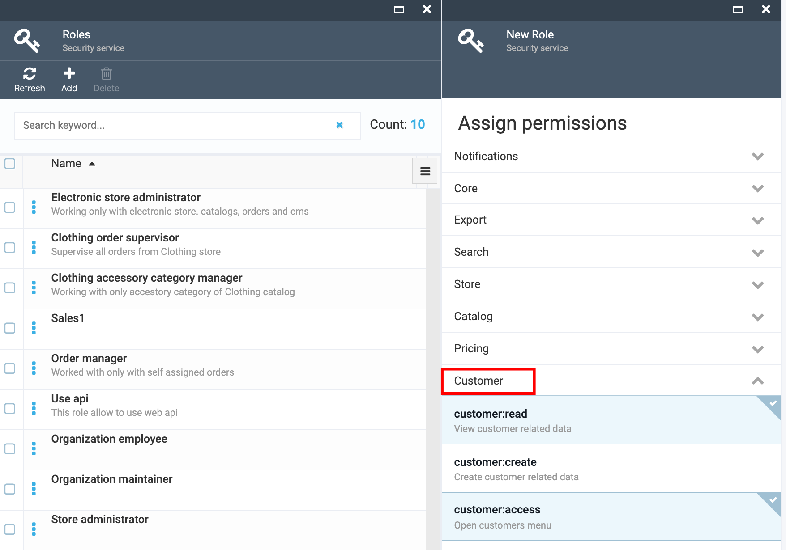

# Create a Sales Role with Permissions

1. Go to More->Security->Roles;
1. In the opened 'Roles' blade click the 'Add' button;
1. Under the 'Name' enter 'Sales';
1. Enter the description if needed into the 'Description' text box;

1. Assign the following permissions:
     1. Select Customer and select Customer permissions:
         1. customer:access
         1. customer:read
     1. Select Platform and select Platform permissions:
         1. platform:security:access
         1. platform:security:read
         1. platform:security:update

1. Click the 'Create' button
1. The new Sales role with corresponding permissions will be created.