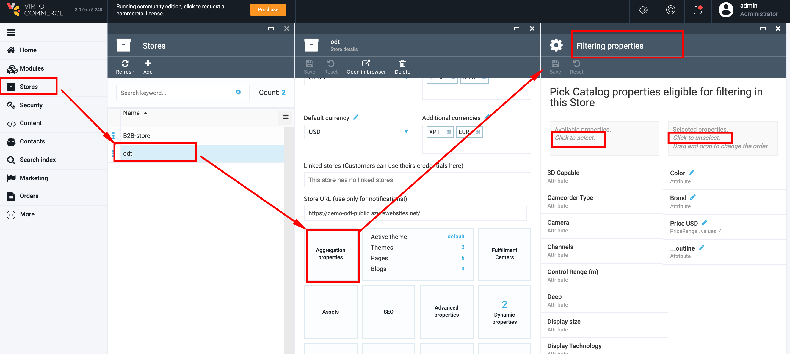
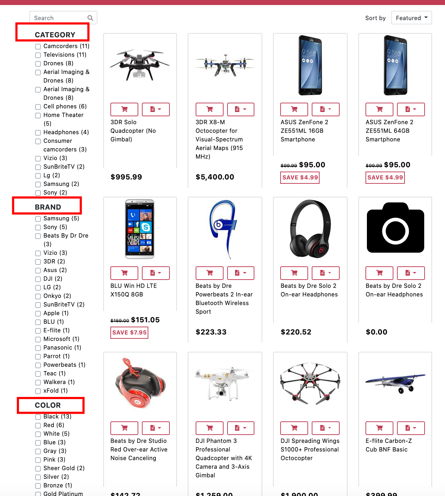

# Manage Aggregation Properties

The aggregation properties are assigned to the Store. In order to manage ODT aggregation properties, you should go through the following steps:

1. Go to More->select the Stores module;
1. In the opened 'Stores' blade select 'ODT';
1. The system will display the Store details;
1. To view the Store aggregation properties, click on the 'Aggregation properties' widget;
1. The system will open the 'Filtering properties' blade, where you can specify the properties that should be displayed in the filter on the Storefront;
1. If you want to add a property to the filter, simply click on the property from the list on the left;
1. If you want to remove a property from the filter, click on the property from the list on the right side;
1. Once you have made the changes, click the 'Save' button;
1. Go to Storefront and view the changes you made.

