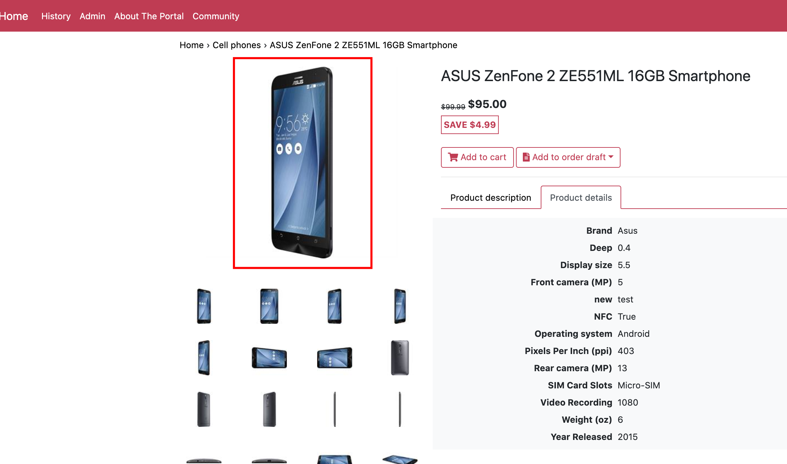

# Manage Product Images

## View product images

1. Go to More->Catalog->Categories and items-> select the product and open Product details
1. Select the 'Images' widget
1. The system will display all product images that were uploaded before
1. Every image has a priority. The lower is the number, the higher is the priority. Ex., image with priority '0' is the image with the highest priority and this image will be displayed as the main one.

Storefront

## Edit product images

1. Open product details and select 'Images' widget;
1. Select the image you want to edit from the list and under the three dots menu select the 'Edit' option;
1. In the opened blade you can edit the image category and select a different language;
1. Once the changes are made, click the 'OK' button to confirm saving the changes;
1. The image details will be edited.

## Generate thumbnails

## Documentation

https://github.com/VirtoCommerce/vc-module-image-tools