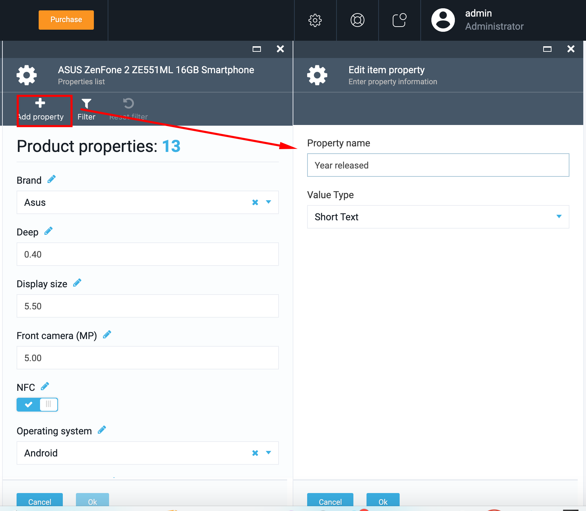

# How to Manage Product Properties

## View Product Properties

1. Log in to VC and go to More->Catalog->select a catalog;
1. Select a category in the Categories & Items blade (ex, Cell phones);
1. Select a product and in the opened Product details blade select the 'Properties' widget;
1. The system will display the 'Properties list' blade. Here you can see the properties which were added to the product before.
1. The product properties added to the product in VC are visible on the Storefront under the Product details tab.

## Add Product Properties

1. Log in to VC and go to More->Catalog->select a catalog;
1. Select a category in the Categories & Items blade (ex, Cell phones);
1. Select a product and in the opened Product details blade select the 'Properties' widget;
1. Click the 'Add property' button; 
1. Enter the Property name into the 'Property name' field;
1. Select Value type from the drop down, ex. 'Short text';
1. Click 'OK' to save the new property;
1. Reload the blade;
1. The Properties widget will display the updated number of Product properties.

**Important!** Product properties contain no met data. For this reason only two fields will be displayed.

## Edit Product Property

1. Select the property that you want to edit from the Property list and click on the 'Edit' icon;
1. The system displays the 'Edit property information' blade;

1. The user can edit the following property values:

     1. Display name
     1. Switch on/off:
         1. Dictionary
         1. Multivalue: if switched on, the user can specify more than one property value.
         1. Multilanguage
         1. Hidden
    1. 'Applies to' (select from drop down): 
         1. Product
         1. Category
         1. Variation
    1. 'Value type' should be selected from drop down;

### Set up validation rules

1. Required- switch on/off;
1. Limit character count- switch on/off with possibility to specify the min and max characters;
1. Match a specific pattern. If switched on, then specify the pattern:

     1. custom;
     1. Email;
     1. URL;
     1. Date.

### Edit Dictionary

1. Open 'Dictionary' blade;
1. To add a new dictionary, click on the 'Add' button;
1. Enter the Alias and specify priority;
1. Save the changes;
1. To delete an alias, simply select the alias from the list (use the check box)and click 'Delete'
1. The alias will be deleted.

### Manage property attributes

1. Open the 'Attributes' blade
1. If necessary add an attribute:

      1. Enter the Attribute name;
      1. Enter the Attribute value;
      1. Click 'Add';
      1. Save the changes;
1. To delete and attribute, select the attribute from the 'Current attributes' list and click the 'Delete' button.

