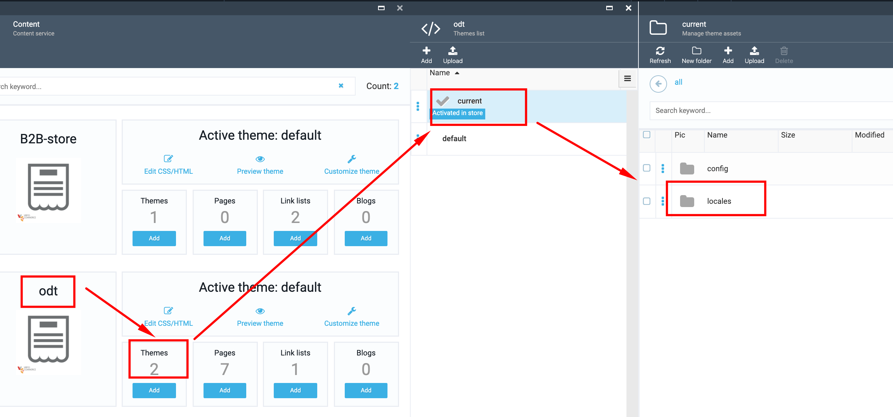
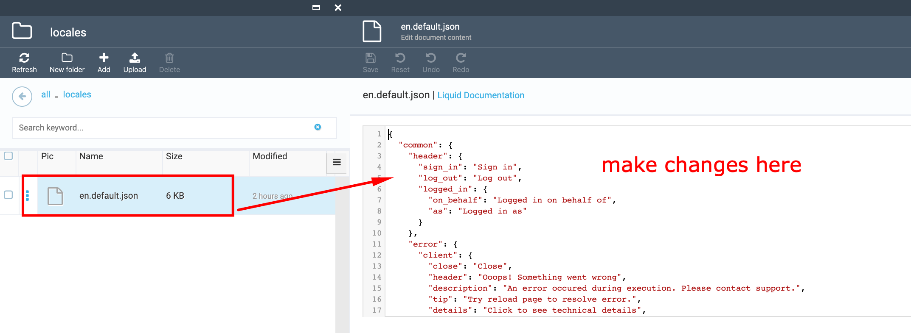

# How to rename/change/fix text misspelling via admin UI

1. Go to Content module->select ODT store ->select the 'Themes' widget;

1. In the opened 'Themes list' blade select the 'current' theme (activated in store);

1. Select the 'locales' folder;

1. Select the 'en.default.json' file;

1. Find the label that should be changed in the opened json file;

1. Make the changes you need;

1. Click the 'Save' button;

1. Open the Storefront and view the changes.